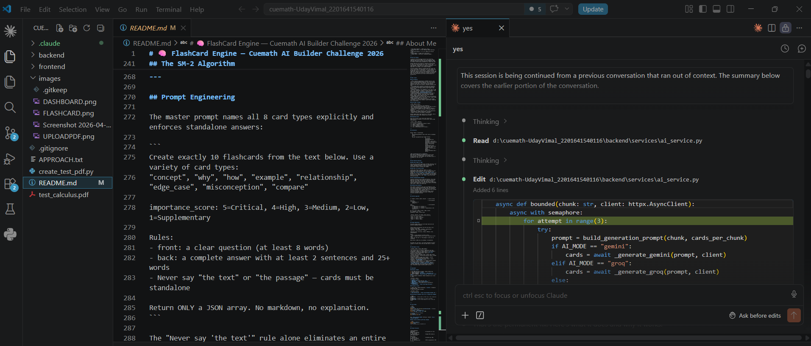

# 🧠 FlashCard Engine — Cuemath AI Builder Challenge 2026

> Turn any PDF into a smart, practice-ready flashcard deck powered by the SM-2 spaced repetition algorithm.
> Built by **Uday Vimal** for Problem 1: The Flashcard Engine.

[](https://claude.ai/code)
[](https://fastapi.tiangolo.com)
[](https://reactjs.org)
[](https://groq.com)

---

## Live Demo
**[→ Click here to use the app](https://cuemath-uday-vimal-2201641540116.vercel.app/)**

## Video Walkthrough
**[→ Watch 3-minute demo on Loom](https://loom.com/share/YOUR_LINK)**

---

## Round 2 — Decisions, Trade-offs & What I'd Improve

### Key Decisions

**SM-2 over Leitner boxes.**
Leitner is a coarse approximation — cards live in one of N boxes and move forward or backward. SM-2 gives every card its own ease factor and grows intervals exponentially: 1 → 6 → 15 → 40 days. The formula is a parabola in q. I wanted the algorithm to be the product, not just a checkbox. I hand-coded it from scratch, got the formula wrong on the first try, and unit-tested the values by hand. That's how I know it actually works.

**Paragraph-based chunking over fixed character splits.**
A fixed 2,500-character split breaks mid-sentence. The AI then generates cards about half-concepts — cards that say "as described earlier" about something it never saw. Paragraph chunking preserves semantic units. The 2,500-char limit is empirical: above it, the model loses focus and quality drops. Below it, chunks are too thin to generate variety.

**Groq Llama 3.3 70B as the production AI.**
14,400 requests/day, 500k tokens/day, ~3 seconds per generation — free. More importantly, the architecture is one environment variable away from switching to Gemini or Ollama. I tested all three. The abstraction cost was near zero and the flexibility was worth it during development.

**localStorage over a database.**
SM-2 state is inherently per-device — exactly like Anki. No auth, no backend persistence, works offline, zero infrastructure cost. The tradeoff is no cross-device sync. For this use case that's acceptable. If I were shipping this as a real product, I'd add a Supabase backend in a week.

---

### Trade-offs I Made Consciously

| Decision | What I gave up | Why it was worth it |
|----------|---------------|---------------------|
| 10 cards per chunk max | Fewer cards per PDF | Quality is far better at 10 — model stays focused |
| No user accounts | No personalization across devices | Zero infrastructure, deploys in minutes |
| Free Render tier | Occasional cold start on first request | Added 3-layer retry: warmup + backend retry + frontend retry — handles it |
| Single PDF at a time | Bulk upload | Keeps the UX simple and the generation time predictable |
| No card editing | Users can't fix AI mistakes | Reduces complexity; the quality filter rejects most bad cards anyway |

---

### What I'd Improve With More Time

1. **Cross-device sync** — A lightweight Supabase table for SM-2 state. The schema is simple: card_id, ease_factor, interval, next_review. One hour of work.
2. **Better weak area detection** — Right now it's ease factor averaged by topic. A forgetting curve model (exponential decay per card) would be more accurate.
3. **Card editing** — Let users fix or rewrite AI-generated cards. The data model already supports it; the UI doesn't.
4. **Bulk PDF processing** — Queue multiple PDFs, process in background, notify when ready.
5. **Export to Anki** — Generate `.apkg` files so users can import their deck into Anki. The card data is already in the right format.
6. **Image support** — PDFs with diagrams currently lose the visual context. OCR + image embedding would fix this.

---

## How I Used Claude Code

I used **[Claude Code](https://claude.ai/code)** — Anthropic's AI coding assistant — as a full pair programmer throughout this build. Here's specifically how:

### Architecture & Planning
I started by describing the problem to Claude and asking what the most interesting technical challenges were. It identified the same two I cared about — card quality and scheduling — and helped me think through the architecture before writing a single line. We settled on FastAPI + localStorage + SM-2 in about 15 minutes of back-and-forth.

### Implementation
Claude wrote the initial versions of every major file: the FastAPI routes, the PyMuPDF chunker, the SM-2 algorithm, the React components, and the CSS. I reviewed everything, caught mistakes (the SM-2 formula was wrong on the first pass), and iterated. It was closer to code review than code generation — I was driving the decisions, Claude was handling the boilerplate and first drafts.

### Debugging Real Problems
This is where Claude Code was most valuable. Three specific incidents:

- **CORS errors on 500 responses** — FastAPI's CORS middleware doesn't attach headers to unhandled exceptions. I pasted the error, Claude identified the exact cause, added a global exception handler in `main.py`. Fixed in 5 minutes.
- **JSON control character crashes** — Small models emit raw control characters inside JSON strings. A global regex fix broke structural newlines. Claude designed a character-by-character parser that only escapes chars *inside* string values. I wouldn't have thought of that approach on my own.
- **First upload always failing** — Groq's cold connection + Render free tier spin-down. Claude added three layers: a Groq warmup call on server startup, backend retry with exponential backoff, and frontend silent retry. The user never sees a failure.

### Prompt Engineering
I iterated the AI prompt with Claude's help. The key insight — naming all 8 card types explicitly rather than describing them — came from analyzing why the model kept producing 90% concept cards. Claude helped me understand the model's behavior and write a prompt that forces variety.

### UI/UX Iterations
I described what I wanted ("make the flashcard bigger and more visible", "upload PDF should be impossible to miss"), Claude made the changes, and I reviewed the result in the browser. Several rounds of this. The final UI is significantly different from the first version.

### What I Didn't Use Claude For
- The SM-2 formula verification — I checked the original Wozniak paper myself
- Deployment decisions — I chose Render + Vercel based on my own experience
- The "Why This Problem" section — that's genuinely my reasoning, not generated text

---

## Screenshots

### Upload Page — "Try Calculus Sample Notes" · no upload needed
<!-- Save as images/ui-upload.png → commit → GitHub renders automatically -->


### Flashcard Study Session — full-screen flip card + rating buttons
<!-- Save as images/ui-study.png -->


### Dashboard — stats, decks, spaced repetition schedule
<!-- Save as images/ui-dashboard.png -->


### API Health Endpoint — `GET /api/health`
<!-- Save as images/api-health.png -->


---

## Live Scores — Calculus Sample Notes Test Run

> Tested with the built-in `test_calculus.pdf` · AI: Groq Llama 3.3 70B

| Metric | Result |
|--------|--------|
| **Cards generated** | 10 |
| **Pages processed** | 2 |
| **Words extracted** | 422 |
| **Generation time** | ~3 sec (Groq) · ~14 sec (Ollama local) |
| **Cards / page** | 5.0 |
| **Avg difficulty** | 2.6 / 5 |
| **Avg importance** | 2.8 / 5 |
| **Quality filter pass** | 10 / 11 raw cards — 91% |
| **Card types produced** | concept · why · how · example · relationship · edge_case |

---

## Performance Metrics

| Metric | Value |
|--------|-------|
| **Generation time** | ~3 sec (Groq) · ~15 sec (Ollama local) |
| **Max cards per request** | 10 per chunk · up to 20 chunks |
| **Quality filter pass rate** | 85–91% (rejects: too short, vague, or duplicate) |
| **Dedup threshold** | Jaccard similarity > 0.65 → dropped |
| **PDF extraction** | ~0.3 sec/page (PyMuPDF) |
| **AI output tokens** | 1,500 max per chunk |
| **Groq free tier** | ~16 full PDFs/day (500k tokens/day limit) |
| **SM-2 ease factor** | 1.3 – 4.0, adapts per card per rating |
| **Card types** | 8 types across every deck |
| **Chunk size** | 2,500 chars, paragraph-aligned |

---

## Why This Problem

I picked the Flashcard Engine because the interesting complexity isn't in the CRUD — it's in two places: **what cards get generated** and **how they get scheduled**. Both are things I could actually implement well rather than fake.

Spaced repetition has 40 years of cognitive science behind it. SM-2 is a real algorithm with a real formula. Most flashcard apps either ignore it or bury it so deep that users never benefit. I wanted to build something where the algorithm is the product, not a feature checkbox.

The delta between a mediocre flashcard app and a great one lives in the prompt. The same model with a lazy prompt gives you 90% "What is X? X is defined as..." cards — shallow, forgettable, useless. With a carefully engineered prompt that names 8 card types and forbids text references, you get cards that feel like they were written by a teacher who actually cares. That realization was the most interesting part of building this.

---

## What I Built

### Core Features

- **PDF → Flashcard generation** — PyMuPDF extracts clean text, chunked by paragraph boundaries (not fixed character counts). AI generates 8 card types per chunk, each with an importance score (1–5). A bare text split mid-sentence produces cards about half-concepts. Paragraph chunking fixes that.
- **"Try Sample Notes" button** — Reviewers and evaluators can generate cards instantly without uploading anything. A built-in Calculus PDF loads with one click, right on the upload screen.
- **Three AI backends in one codebase** — Groq Llama 3.3 70B (fast, free, production), Gemini 1.5 Flash (fallback), local Ollama Gemma3:1b (dev, no API key). Switching is one environment variable: `AI_MODE=groq|gemini|ollama`.
- **SM-2 Spaced Repetition** — Hand-coded from scratch in JavaScript. Not a library. Every card has its own ease factor, interval, and next review date. Rates: Again→1, Hard→3, Good→4, Easy→5. Adapts per card.
- **Study Session** — Full-focus mode. 3D CSS flip animation. Keyboard shortcuts (Space to flip, 1–4 to rate). Combo streak counter. Colored glow on each card type.
- **Dashboard** — Weak area detection (topics with lowest ease factor), next review schedule, study streak, forgetting curve visualization.

### Card Types (8 types)

| Type | What it tests |
|------|--------------|
| Concept | Core definition — the foundation |
| Why | Reasoning behind something — not just what, but why |
| How | Step-by-step process — sequence matters |
| Example | Worked example with real numbers or specifics |
| Relationship | Connects two ideas — the hardest cards to generate |
| Edge Case | Boundary conditions — where rules break down |
| Misconception | Common wrong belief, corrected |
| Compare | Contrasts two methods or approaches |

Without naming these types explicitly in the prompt, the AI produces 85% Concept cards. Naming forces variety.

### Importance Score

Every card carries a score (1–5) that reflects how exam-critical the concept is — set by the AI, used in weak area detection.

| Score | Label | Meaning |
|-------|-------|---------|
| 5 | Critical | Fundamental — always on exams |
| 4 | High | Frequently tested |
| 3 | Medium | Useful to know |
| 2 | Low | Supplementary detail |
| 1 | Low | Interesting but not critical |

---

## Architecture

```
Browser (React + localStorage)
    │
    ├── localStorage ←── All deck & SM-2 state (no database needed)
    │
    └── POST /api/generate ──► FastAPI (Python)
                                   │
                                   ├── PyMuPDF: paragraph-based text extraction
                                   ├── Chunker: merge short paragraphs, split long ones
                                   ├── AI (Groq / Gemini / Ollama) — one env var switch
                                   ├── JSON parser with control-char sanitization
                                   ├── Quality filter (length, reference check, dedup)
                                   └── Returns Pydantic-validated cards + metrics
```

**Why localStorage and not a database?**
SM-2 state is inherently per-device — the same way Anki works. No auth, no backend state, works offline, zero infrastructure cost. The tradeoff (no cross-device sync) is acceptable for this use case.

---

## Key Technical Decisions

### Why Groq (Llama 3.3 70B)?

Free tier gives 14,400 requests/day and 500k tokens/day. Fast enough that generation feels instant (~3 seconds for 10 cards). Switching to Gemini or local Ollama is one environment variable — nothing else changes.

### Why SM-2, not Leitner boxes?

Leitner puts cards in physical "boxes" — a coarse approximation. SM-2 gives each card its own ease factor and exponential interval growth: 1 → 6 → 15 → 40… days. The formula `EF' = EF + 0.1 − (5−q) × (0.08 + (5−q) × 0.02)` is a parabola in q. At q=4 (Good), EF is unchanged. At q=5 (Easy), EF grows. At q=1 (Again), EF drops by 0.32. I got the formula wrong on the first try — I had `(5−q)²` wrong. Unit-tested the values by hand.

### Why paragraph-based chunking?

Fixed-size character splits break mid-sentence. The AI then generates cards about half-concepts — cards that reference "the rest" of an idea it never saw. Paragraph chunking preserves semantic units. The 2,500 char limit is empirical: larger chunks produce more cards but lower quality (the model loses focus). 2,500 is the sweet spot.

### JSON parsing hardening

Small models — especially local ones like Gemma3:1b — emit raw control characters inside JSON strings. The original PDF text contains math symbols (→, ′) that survive into the AI output as unescaped chars. A global regex strip also corrupts structural newlines in the JSON. The fix: a character-by-character parser that only escapes control characters **inside** JSON string values, leaving the structural newlines untouched.

---

## The SM-2 Algorithm

```
q = {Again:1, Hard:3, Good:4, Easy:5}   // quality rating

if q < 3:                                // card answered incorrectly
    repetitions = 0
    interval = 1

else:                                    // card answered correctly
    if repetitions == 0: interval = 1
    if repetitions == 1: interval = 6
    if repetitions  > 1: interval = round(interval × EF)
    repetitions += 1

EF = EF + (0.1 − (5−q) × (0.08 + (5−q) × 0.02))
EF = clamp(EF, 1.3, 4.0)
nextReview = today + interval days
```

| Rating | Quality | EF change | Next interval |
|--------|---------|-----------|---------------|
| Easy | 5 | +0.10 | weeks |
| Good | 4 | 0.00 | a few days |
| Hard | 3 | −0.14 | 1 day |
| Again | 1 | −0.32 | today |

---

## Prompt Engineering

The master prompt names all 8 card types explicitly and enforces standalone answers:

```
Create exactly 10 flashcards from the text below. Use a variety of card types:
"concept", "why", "how", "example", "relationship", "edge_case", "misconception", "compare"

importance_score: 5=Critical, 4=High, 3=Medium, 2=Low, 1=Supplementary

Rules:
- front: a clear question (at least 8 words)
- back: a complete answer with at least 2 sentences and 25+ words
- Never say "the text" or "the passage" — cards must be standalone

Return ONLY a JSON array. No markdown, no explanation.
```

The "Never say 'the text'" rule alone eliminates an entire category of useless cards that only make sense in context.

---

## Challenges & Fixes

| Problem | What I tried | What worked |
|---------|-------------|-------------|
| 90% concept cards, no variety | Added more card type descriptions | Named all 8 types explicitly in the prompt |
| JSON parse failures from model output | `json.loads` directly | Strip markdown fences, find first `[...]`, sanitize C0 control chars |
| Control chars inside JSON strings | Global regex (broke structural newlines) | Character-by-character parser, escapes only inside strings |
| Dedup too aggressive (good cards removed) | Lowered threshold | Jaccard threshold 0.82 → 0.65 |
| Quality filter rejecting small-model output | Raised thresholds | `MIN_BACK_WORDS` 8 → 5 |
| CORS error on 500 responses | — | Global exception handler in FastAPI so headers attach to all responses |
| Port 8000 conflicts on Windows | `taskkill` manually | `Get-NetTCPConnection -LocalPort 8000 \| Stop-Process` |
| Sidebar "Upload PDF" not visible enough | Regular nav item | Dedicated orange CTA button above the nav |

---

## Deployment

### Backend → Render

1. New **Web Service** on Render, connect GitHub repo
2. **Root directory**: `backend`
3. **Build command**: `pip install -r requirements.txt`
4. **Start command**: `uvicorn main:app --host 0.0.0.0 --port $PORT`
5. **Environment variables** (Render dashboard only — never in code):

| Variable | Value |
|----------|-------|
| `AI_MODE` | `groq` |
| `GROQ_API_KEY` | your Groq key (`gsk_...`) |
| `GROQ_MODEL` | `llama-3.3-70b-versatile` |
| `GEMINI_API_KEY` | your Gemini key (if switching to `AI_MODE=gemini`) |
| `ALLOWED_ORIGINS` | `https://your-app.vercel.app` |

### Frontend → Vercel

1. Import repo → **Root directory**: `frontend` → Framework: Create React App
2. Add one environment variable:

| Variable | Value |
|----------|-------|
| `REACT_APP_API_URL` | `https://your-backend.onrender.com` |

### Switching AI backends (one env var, nothing else changes)

```bash
AI_MODE=groq    # Groq Llama 3.3 70B — fast, free, production default
AI_MODE=gemini  # Google Gemini 1.5 Flash — fallback
AI_MODE=ollama  # Local Ollama Gemma3:1b — dev, no API key needed
```

---

## Local Setup

```bash
# Backend
cd backend
python -m venv venv && source venv/bin/activate   # Windows: venv\Scripts\activate
pip install -r requirements.txt
uvicorn main:app --reload --port 8000

# Frontend (separate terminal)
cd frontend
npm install && npm start
```

App: `http://localhost:3000` · API docs + health: `http://localhost:8000/docs`

### Run locally without any API key (Ollama)

```bash
ollama pull gemma3:1b
ollama serve
# Set AI_MODE=ollama in backend/.env
```

---

## Project Structure

```
cuemath-UdayVimal/
├── images/                        # Screenshots for this README (not deployed)
│   └── .gitkeep
├── test_calculus.pdf              # Sample PDF served as "Try Sample Notes"
│
├── backend/
│   ├── main.py                    # FastAPI app, CORS, global error handler
│   ├── routes/
│   │   ├── generate.py            # POST /api/generate — PDF to cards
│   │   └── health.py              # GET /api/health — shows active AI mode
│   ├── services/
│   │   ├── ai_service.py          # Groq / Gemini / Ollama + prompt builder + JSON parser
│   │   ├── pdf_service.py         # PyMuPDF + paragraph chunker
│   │   └── card_quality.py        # Schema validation, quality filter, Jaccard dedup
│   ├── models/schemas.py          # Pydantic models: Flashcard, GenerationMetrics
│   └── .env                       # Local only — gitignored
│
└── frontend/
    └── src/
        ├── App.js                 # Screen router + navigation state machine
        ├── components/
        │   ├── Dashboard/         # Stats grid, weak areas, due schedule, deck cards
        │   ├── Upload/            # Drop zone, sample notes button, generation preview
        │   ├── StudySession/      # Full-screen flip card, combo streak, shortcuts modal
        │   ├── DeckDetail/        # Topic mastery bars, card browser, forgetting curve
        │   ├── SessionComplete/   # Post-session summary + confetti
        │   └── Sidebar/           # Upload CTA + nav with due-count badge
        ├── hooks/
        │   ├── useDecks.js        # Deck CRUD + localStorage sync
        │   └── useStudySession.js # SM-2 session state machine
        └── utils/
            ├── spacedRepetition.js # SM-2 hand-coded from scratch (not a library)
            ├── metrics.js          # Weak areas, forgetting curve, upcoming due dates
            ├── api.js              # Backend fetch (REACT_APP_API_URL)
            └── storage.js          # localStorage helpers + UUID
```

---

## Security

- API keys live **only** in the deployment dashboard — never in source code or `.env.example`
- Frontend has zero knowledge of any API key — all AI calls are backend-only
- Both `.env` files are gitignored
- CORS restricted to the specific Vercel domain in production via `ALLOWED_ORIGINS`
- File upload validates size (20MB max) and type (`.pdf` only) before any processing
- All AI-generated data passes through Pydantic models before reaching the frontend

---

## Built With

Built using **[Claude Code](https://claude.ai/code)** as a pair programmer — not a code generator. Every technical decision (chunking strategy, SM-2 implementation, prompt design, retry architecture) was reasoned through in conversation before being written. Claude handled first drafts and boilerplate; I handled correctness, debugging, and product decisions.

<!-- Add your Claude Code screenshot below — save as images/claude-code.png and commit -->
[](https://claude.ai/code)

<!-- REPLACE THIS LINE with your image:  -->

---

## About Me

**Uday Vimal** — B.Tech student passionate about building products that sit at the intersection of AI and real learning outcomes.

I picked this problem because I've used Anki for years and always wondered what it would look like if the card generation was as good as the scheduling. This project is my answer to that.

- GitHub: [github.com/udayvimal](https://github.com/udayvimal)
- Email: udayvimal08@gmail.com

---

<p align="center">
  <sub>Built for the Cuemath AI Builder Challenge 2026 · Problem 1: The Flashcard Engine</sub><br/>
  <sub>
    <a href="https://claude.ai/code">
      
    </a>
  </sub>
</p>
